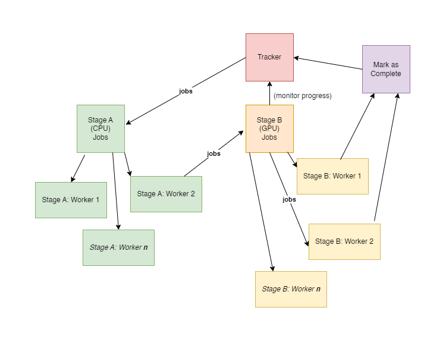

# Distributed-Compute-Tracker
[](https://discord.gg/dall-e)

A server previously powering LAION's distributed compute network for filtering commoncrawl with CLIP to produce the LAION-400M and LAION-5B datasets, now repurposed as a general-use multi-layer distributed compute tracker and job manager, with added support for a frontend web server dashboard, user leaderboards and up to 5 recursive layers of workers for each job.



Workers at each stage of the job workflow recieve the input(s) created by previous workers, and perform their specialised task before workers at the next stage continue the job with their task.

## Installation
1. Install requirements
```
git clone https://github.com/TheoCoombes/Distributed-Compute-Tracker.git
cd Distributed-Compute-Tracker
pip install -r requirements.txt
```
2. Setup Redis
   - [Redis Guide](https://www.digitalocean.com/community/tutorials/how-to-install-and-secure-redis-on-ubuntu-20-04) - follow steps 1-2.
   - You may need to configure your Redis connection url in `config.py` if you have changed any port bindings.
3. Setup SQL database
   - [PostGreSQL Guide](https://www.digitalocean.com/community/tutorials/how-to-install-and-use-postgresql-on-ubuntu-20-04) - follow steps 1-4, noting down the name you give your database.
   - Install the required python library for the database you are using. (see link above)
   - Configure your SQL connection in `config.py`, adding your database name to the `SQL_CONN_URL`.
4. Add Jobs
   - Create a JSON file containing a list of strings, each with job data (e.g. urls / filenames to process etc.) and run `init.py --json <file>` to setup the database.
   - Alternatively, you can also create a brace expansion for your initial job data, e.g. `init.py --brace "{00..99}.tar"`.
   - For more info, run `init.py --help`.
   - WARNING: running init.py will reset your database, so ensure you make a backup of any previous data before running the script!
5. Setup Project
   - Open `config.py`, and rename `PROJECT_NAME` to a more suitable name for your project.
   - Edit `STAGE_<N>` to add the names of each stage of your workflow. If the next stage is set to None, the job is marked as complete. Otherwise, workers operating at the next stage will recieve the output of the current stage as an input.
   - If you would like a linear `input -[worker]-> output` workflow, only enable `STAGE_A`.
   - The default setting is the workflow used previously for the production of the LAION-5B dataset. CPU workers at stage A would download and store images+alt text from CommonCrawl in tar files. GPU workers at stage B would then be inputted with these tar files, and then filter these images using CLIP to create the final dataset. [(see paper)](https://arxiv.org/abs/2210.08402)
6. Start ASGI server
   - You can either use `gunicorn` or `uvicorn`. Previously, the LAION-5B production server used `uvicorn` with 12 worker processes.
   - e.g. `uvicorn main:app --host 0.0.0.0 --port 80 --workers 12`

## Usage
As stated in step 5 of installation, you need to run the server directly using a ASGI server library of your choice:
```
uvicorn main:app --host 0.0.0.0 --port 80 --workers 12
```
- *Runs the server through Uvicorn, using 12 processes.*
